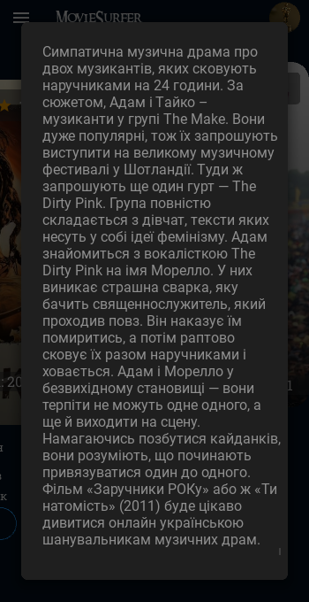

# MovieSurfer
<i>The program does not contain a file containing the information for connecting to the database. </i>

### The names of the tables used:
```
movies - for the general list of movies
own_films - for the list used by the user to add movies by the user
users - for adding new users
```
---
## Description
The program is designed for easy selection and search of movies and TV series. The program will also recommend movies to users.

---

## Usage Guide
When launching the program, the user needs to go through the authorization process, if the user is not registered in the system, you need to go to the registration page and go through it, then log in.

 

On the main page, the user can view recommended movies and other movies from the database. In addition, the user can search for a movie by name. 


To add or view information about a movie, you need to click on the desired movie, then the information page opens. This page contains the following information: title, photo, genres, duration, rating, description, a button to add a movie, and a button to return to the main page. When a movie is added, a message is displayed and the user is automatically returned to the main page.
To go to other pages of the program, all pages have a drop-down menu in the upper left corner.


The menu after the main page contains 3 search pages, where you can search by genre, director, and year of the movie.


The search page by genre and year contains a list of available searches, which you need to click to generate a list of movies. The search by director page has a line for entering the name of the director, and this data is used to perform the search.


The program also contains a page for your own list. It displays the movies added by the user. To view all the movies, you can scroll to the right. 


To view the movie description, click on the "description" button. To delete a movie, click the button located on top of the photo "-".




---

## What was used

```
patter MVC (Model View Controller)
python 3.9.10
pip install kivy==2.2.1
pip install kivymd==1.1.1
pip install psycopg2==2.9.6
```

---
